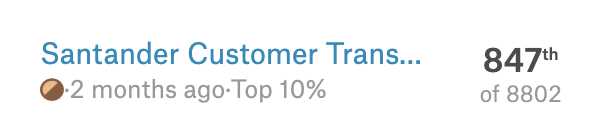

# ML_Competition

* Santander Customer Transaction Prediction
  * Identify which customers will make a specific transaction in the future
  * No much feature engineering since original features already been PCA or transformed by provider
  * Using lgbm with optimised parameters -> LB: 0.9
  * score:  
  	
* Tbrain - house price prediction
  * [Explore data analysis](<https://github.com/chloe0730000/ML_Competition/blob/master/Tbrain_house_price/EDA.ipynb>)
  * Predict house price based on given features
  * Using lgbm with optimised parameters -> LB: 5720.8642526724
  * score: 162/1330 (Top 12%)
